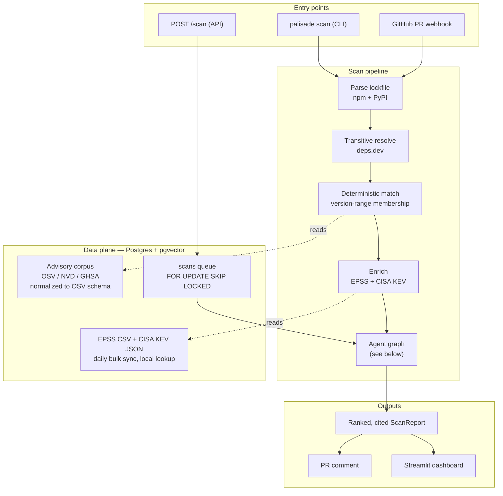
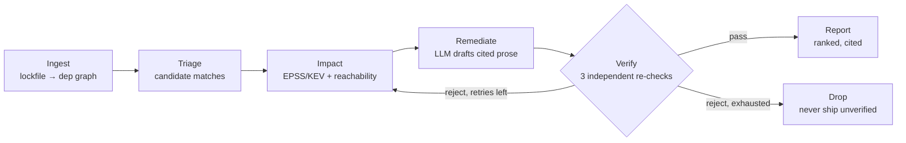

# Palisade

**A self-verifying, multi-agent software-supply-chain vulnerability intelligence agent.**

Point Palisade at a repository (or a raw lockfile) and it returns a ranked, de-noised,
fully-cited list of the vulnerabilities that *actually* matter for that codebase — plus
concrete, verified remediation steps.

Its thesis is **verifiable grounding**: no dependency is called "vulnerable" unless the
installed version falls inside a machine-checked affected-version range from an authoritative
source (OSV / NVD / GHSA), severity is grounded in real exploit signal (EPSS + CISA KEV),
and a dedicated **Verifier** agent rejects any unsupported or version-mismatched claim before
the report is returned. The LLM explains and drafts; it never decides *whether* something is
vulnerable.

> The GitHub repo is named **CVEAgent**; **Palisade** is the product/package name used
> throughout the code and docs.

## Results

On the pinned golden set (6 cases — npm + PyPI, vulnerable and patched variants), measured
against a naive "flag every advisory that mentions the package name" baseline:

| Metric | Baseline | Palisade |
|---|---|---|
| False positives | **18** | **0** |
| FP reduction vs baseline | — | **100%** |
| Precision / recall | — | 1.00 / 1.00 |
| KEV-recall | — | 1.00 |
| Version-match accuracy | — | 1.00 |
| Hallucinated-citation catch rate (30 findings) | — | 1.00 |
| Verifier false rejections | — | 0 |

Reproduce offline (no keys, no network) with `uv run python -m evals.run_eval`. Honest
caveats on what precision/recall do and don't prove live in [`evals/README.md`](evals/README.md);
the story behind the numbers is in [`docs/WRITEUP.md`](docs/WRITEUP.md).

## Architecture



The **agent graph** (LangGraph) threads a single `ScanState` through six nodes, with a bounded
`Verify → Impact` reject loop:



The **deterministic core** (version-range matching, EPSS/KEV lookup, rank scoring) is a set of
pure, unit-tested functions. The LLM only drafts remediation prose and citations; the fix type
and target version are computed deterministically. Every LLM claim then passes an independent
Verifier before it can reach the report.

### The Verifier — three independent re-checks

The Verifier never trusts upstream nodes. For each finding it re-derives the answer from the raw
advisory:

1. **Version in range** — re-checks the installed version against the advisory's affected ranges
   from scratch (independent of the matcher's earlier verdict).
2. **All claims cited** — every citation in the finding and its remediation must trace to the
   advisory's own references. A fabricated source (the exact failure mode of an LLM) fails here.
3. **Severity consistent** — the finding's rank score must re-compute from its own EPSS/KEV/severity
   signals; a rank out of step with its inputs fails.

A finding ships only if all three hold. Otherwise it loops back to Impact for a bounded re-draft,
then is dropped with a reason. See [`docs/WRITEUP.md`](docs/WRITEUP.md) for the real Verifier bug
this design surfaced (a multi-entry advisory it was falsely rejecting).

## Quickstart

Requires [uv](https://docs.astral.sh/uv/) and Docker.

```bash
make install     # create .venv and install deps (uv provisions Python 3.12)
make up-db       # start Postgres + pgvector
make migrate     # apply schema
make run         # API with reload -> http://localhost:8000/health
make test        # pytest
make lint        # ruff + mypy
```

`make up` runs the full stack (Postgres + API) in Docker. Copy `.env.example` to `.env` for local
config; the real `.env` is gitignored. Palisade runs entirely on free, keyless data sources; an
`ANTHROPIC_API_KEY` only upgrades the Remediate node from deterministic to LLM-drafted prose.

## Usage

```bash
# CLI — scan a lockfile, print a ranked cited JSON report
uv run palisade scan path/to/requirements.txt
uv run palisade scan path/to/package-lock.json --engine graph   # M2 agent graph + Verifier

# API — enqueue a scan, then poll for the report
curl -s -X POST localhost:8000/scan \
  -H 'content-type: application/json' \
  -d '{"filename":"requirements.txt","content":"jinja2==3.1.2\n"}'
# -> 202 {"id": "...", "status": "queued"}    (a worker runs it: make worker)
curl -s localhost:8000/scans/<id>             # -> ScanReport when done

# GitHub PR webhook — comments a ranked, cited report on opened/synchronized PRs
#   POST /github/webhook  (HMAC-SHA256 verified; set GITHUB_WEBHOOK_SECRET + GITHUB_TOKEN)

# Dashboard — read-only view over the scans table
make dashboard                                # http://localhost:8501
```

A copy-pasteable 2-minute walkthrough is in [`docs/DEMO.md`](docs/DEMO.md).

## Stack

FastAPI backend · LangGraph agent graph with an independent Verifier · Postgres + pgvector ·
async pg-backed scan queue + worker · bulk-synced OSV/NVD/GHSA/EPSS/KEV data plane · deterministic
version-range matching · GitHub PR-scan webhook · Streamlit dashboard · golden-set eval harness with
a blocking CI eval-regression gate.

## Docs

- **Write-up:** [`docs/WRITEUP.md`](docs/WRITEUP.md) — *How I stopped my security agent from crying wolf.*
- **2-minute demo:** [`docs/DEMO.md`](docs/DEMO.md)
- **Project spec:** [`docs/palisade-project-spec.md`](docs/palisade-project-spec.md)
- **Implementation plan:** [`IMPLEMENTATION_PLAN.md`](IMPLEMENTATION_PLAN.md)
- **Eval harness + honest caveats:** [`evals/README.md`](evals/README.md)

## License

TBD.
